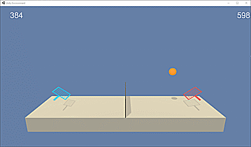
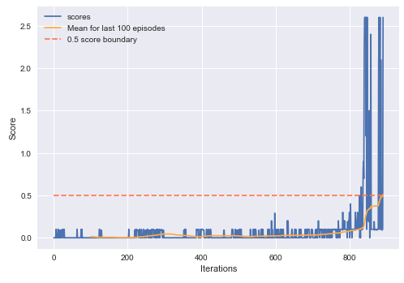

# RL Tennis
Showcase of DDPG implementation in PyTorch



Two agents control rackets to bounce a ball over a net.

## Environment

The observation space consists of 8 variables corresponding to the position and velocity of the ball and racket. Each agent receives its own, local observation.  Two continuous actions are available, corresponding to movement toward (or away from) the net, and jumping. If an agent hits the ball over the net, it receives a reward of +0.1.  If an agent lets a ball hit the ground or hits the ball out of bounds, it receives a reward of -0.01.  Thus, the goal of each agent is to keep the ball in play.

## Algorithm
Agent's brain was a Deep Deterministic Policy Gradient, an Actor-Critic class Reinforcement Learning algorithm, implemented according to https://arxiv.org/abs/1509.02971 with Ornstein-Uhlenbeck random process.

## Results
Agent was able to solve the environment in 881 episodes (mean window starting at 881st episode exceeded solution threshold)



## Installation
#### Pre-requisites
Packages:
- Pytorch
- Numpy
- UnityAgents

Additionaly, Jupyter notebook (or Jupyter lab) for displaying solution

#### Process
You need to manually download environment binaries for your system:
  - Linux: [click here](https://s3-us-west-1.amazonaws.com/udacity-drlnd/P3/Tennis/Tennis_Linux.zip)
  - Mac OSX: [click here](https://s3-us-west-1.amazonaws.com/udacity-drlnd/P3/Tennis/Tennis.app.zip)
  - Windows (32-bit): [click here](https://s3-us-west-1.amazonaws.com/udacity-drlnd/P3/Tennis/Tennis_Windows_x86.zip)
  - Windows (64-bit): [click here](https://s3-us-west-1.amazonaws.com/udacity-drlnd/P3/Tennis/Tennis_Windows_x86_64.zip)
  
After downloading, unpack all files and place them in directory `data/`. Then, swap string in cell 2 
```
env = UnityEnvironment(file_name='Reacher/Reacher.exe')
```
with one proper to your OS. Notebook using pytorch implementation is in location `Tennis.ipynb`
