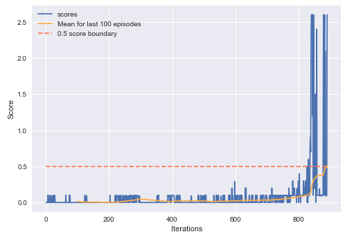

# Algorithm overview
Agent's brain was a Deep Deterministic Policy Gradient, an Actor-Critic class Reinforcement Learning algorithm.

## Parameters
### Hyperparameters
| Parameter | Value|
| --- | --- |
| Replay buffer size | 1e6 |
| BATCH_SIZE | 512 |        
| GAMMA | 0.99 |           
| TAU | 1e-3 |             
| LR_ACTOR | 1e-4 |        
| LR_CRITIC | 1e-3 |       
| UPDATE_EVERY | 4 |

### Actor network architecture:
| Layer | Size |
| --- | --- |
| input | 33 |
| batch_norm | - |
| hidden_1 | 300 |
| ReLU | - |
| batch_norm | - |
| hidden_2 | 200 |
| ReLU | - |
| batch_norm | - |
| output | 4 |

### Critic network architecture:
| Layer | Size |
| --- | --- |
| input | 33 |
| batch_norm | - |
| hidden_1 | 300 |
| ReLU | - |
| batch_norm | - |
| concat with actor output | - |
| hidden_2 | 204 |
| ReLU | - |
| output | 1 |

## Results
Agent was able to solve the environment in 791 episodes (mean window starting at 791st episode exceeded solution threshold).

## Small breakthrougs
Intermediate steps that helped the algorithm

1. Incorporating the idea stating that "the bigger minibatch, the bigger the learning rate should be"

## Improvements ideas
Introducing parameter noise could be a great improvement to quality of learning